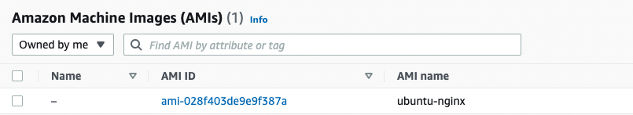
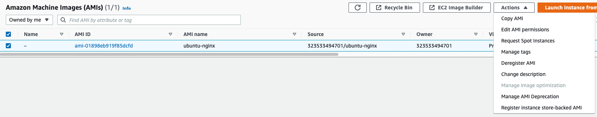
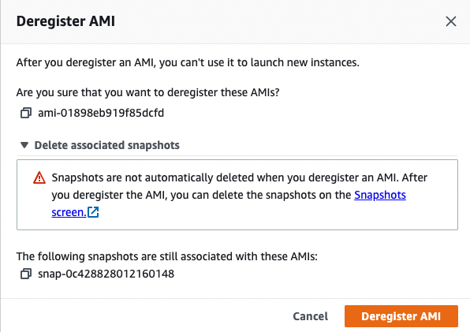
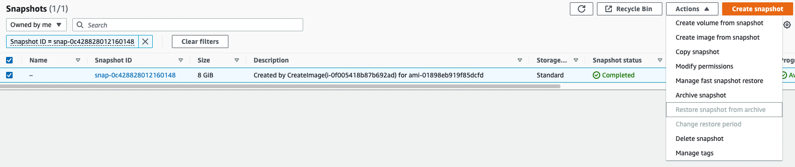

# Create an AMI (Ubuntu with Nginx) with Packer

## Prerquisites

### Packer
Packer needs to be installed.  
See documentation [here](https://learn.hashicorp.com/tutorials/packer/get-started-install-cli) on how to install.

### AWS
You need access to AWS and have these credentials
```
AWS_ACCESS_KEY_ID
AWS_SECRET_ACCESS_KEY
AWS_SESSION_TOKEN
```

## How to
1. Clone the repository locally
```
git clone https://github.com/paulboekschoten/AWSUbuntuNginxWithPacker.git
```

2. Change to the directory
```
cd AWSUbuntuNginxWithPacker
```

3. Set your AWS credentials in your environment
```
export AWS_ACCESS_KEY_ID=
export AWS_SECRET_ACCESS_KEY=
export AWS_SESSION_TOKEN=
```
NB. This is for unix/mac, for windows use `set` instead of `export`.

4. Variables, open `variables.plrvars.hcl` 
- Change the `region` variable to the region you want your AMI to be present.  
The default here is `eu-west-3`
```
region = "eu-west-3"
```
- Change the `ami_name` variable to a name of your liking.  
The default here is `ubuntu-nginx`.
```
ami_name = "ubuntu-nginx"
```

5. Initialise Packer
```
$ packer init .

Installed plugin github.com/hashicorp/amazon v1.1.5 in "/Users/youruser/.config/packer/plugins/github.com/hashicorp/amazon/packer-plugin-amazon_v1.1.5_x5.0_darwin_arm64"
```

6. Format your Packer config file (optional)
```
$ packer fmt .

aws-ubuntu-nginx.pkr.hcl
```

7. Validate your Packer config (optional)
```
$ packer validate .

The configuration is valid.
```

8. Build your AMI with Packer
```
$ packer build --var-file=variables.pkrvars.hcl aws-ubuntu-nginx.pkr.hcl

ubuntu-nginx.amazon-ebs.ubuntu-nginx: output will be in this color.

==> ubuntu-nginx.amazon-ebs.ubuntu-nginx: Prevalidating any provided VPC information
==> ubuntu-nginx.amazon-ebs.ubuntu-nginx: Prevalidating AMI Name: ubuntu-nginx
    ubuntu-nginx.amazon-ebs.ubuntu-nginx: Found Image ID: ami-0df781a928bcfa894
    ubuntu-nginx.amazon-ebs.ubuntu-nginx: Setting up nginx-core (1.18.0-6ubuntu14.2) ...
    ubuntu-nginx.amazon-ebs.ubuntu-nginx:  * Upgrading binary nginx
    ubuntu-nginx.amazon-ebs.ubuntu-nginx:    ...done.
    ubuntu-nginx.amazon-ebs.ubuntu-nginx: Setting up nginx (1.18.0-6ubuntu14.2) ...

...

==> ubuntu-nginx.amazon-ebs.ubuntu-nginx: Synchronizing state of nginx.service with SysV service script with /lib/systemd/systemd-sysv-install.
==> ubuntu-nginx.amazon-ebs.ubuntu-nginx: Executing: /lib/systemd/systemd-sysv-install enable nginx

...

Build 'ubuntu-nginx.amazon-ebs.ubuntu-nginx' finished after 5 minutes 8 seconds.

==> Wait completed after 5 minutes 8 seconds

==> Builds finished. The artifacts of successful builds are:
--> ubuntu-nginx.amazon-ebs.ubuntu-nginx: AMIs were created:
eu-west-3: ami-028f403de9e9f387a
```

9. Go to the AMI management page in AWS and check your AMI is there.



## Note on deleting the AMI
If you don't need the AMI anymore, you need to manually remove it from the AWS console.  

Go to the AMI management page


Select your AMI and under Actions click on `Deregister AMI`


This will open an pop-up that states that snapshots are not automatically deleted.



Expand `Delete associated snapshots` and click on the `Snapshots screen` link.  
This will open a new tab with the snapshots for this AMI.  

Go back to the Deregister AMI popup and click `Deregister AMI`.  

No go to the tab with the snapshots

Select the snapshots to delete and under actions click `Delete snapshot`

Click `Delete` in the confirmation pop-up.
